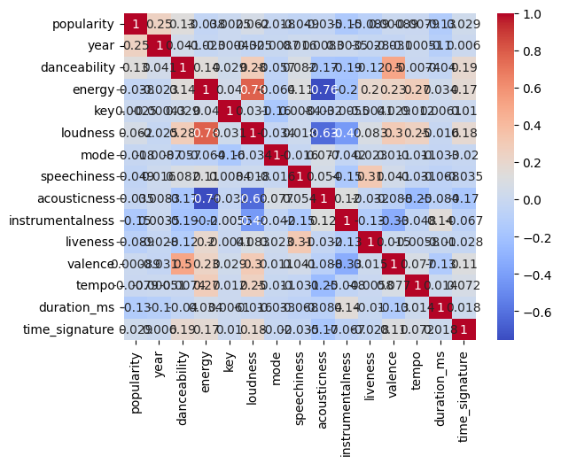
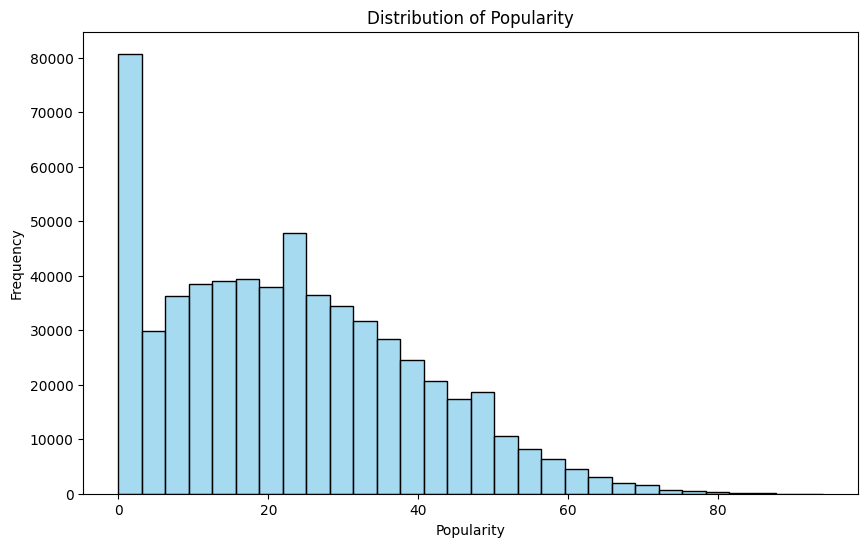
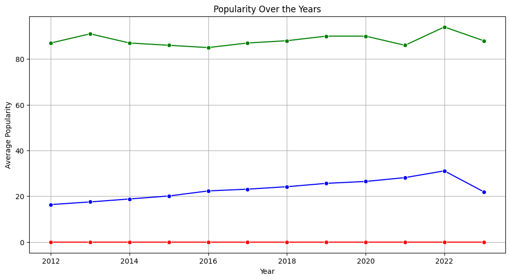
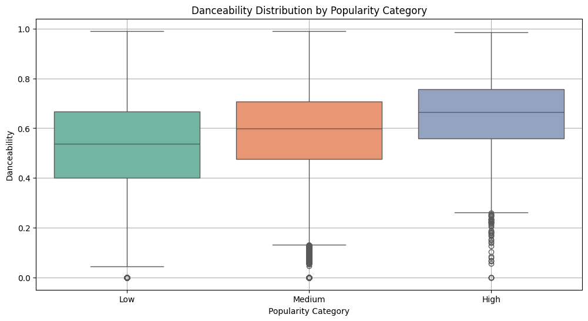
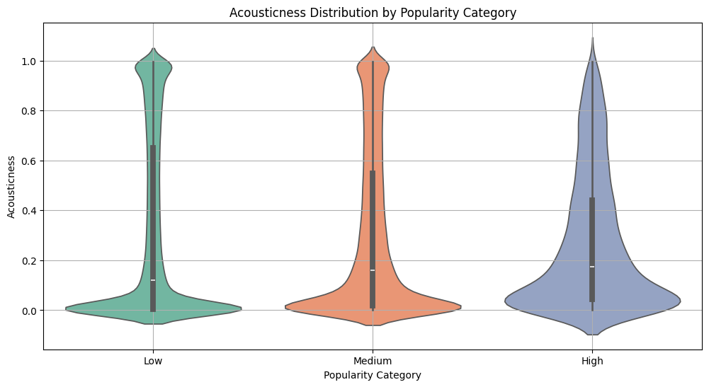
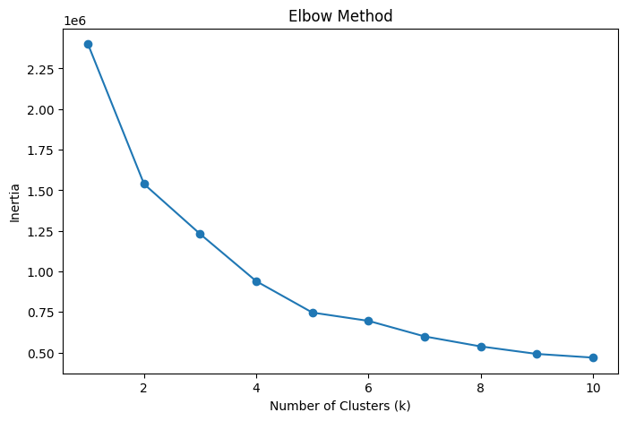
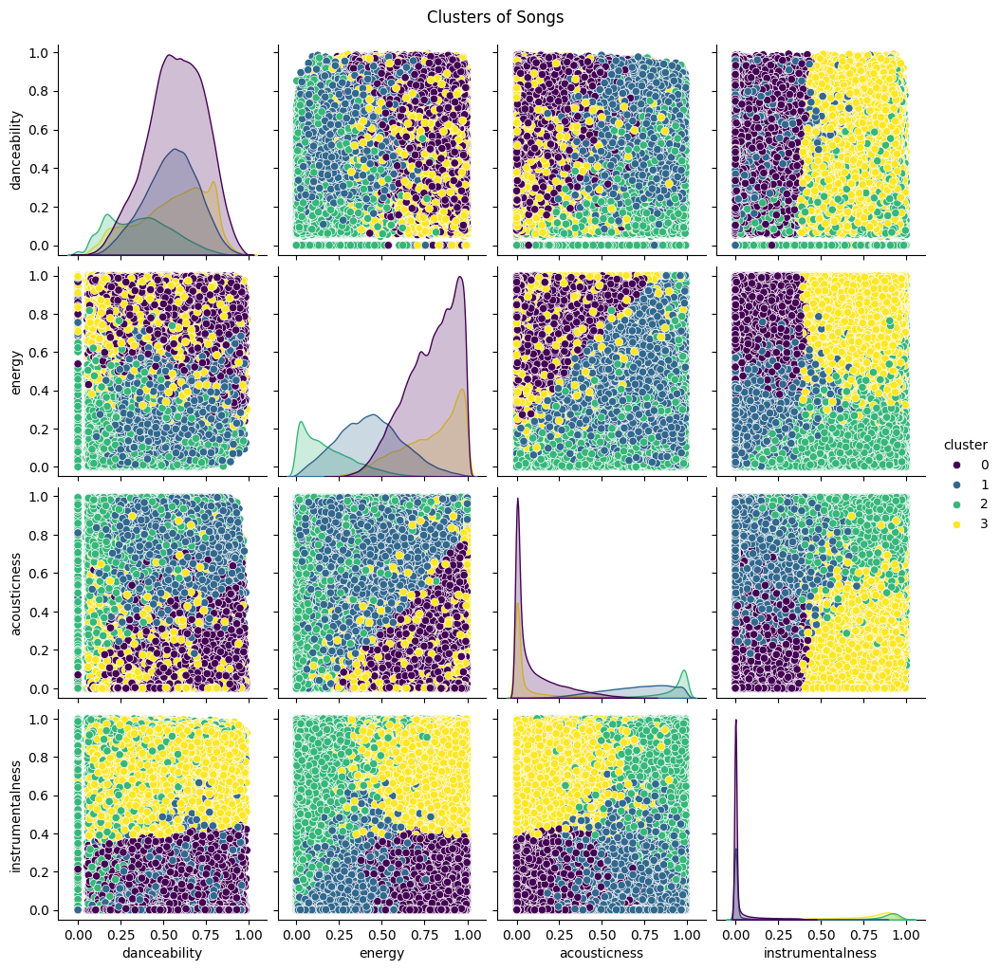

# Predicting Song Popularity Using Regression Models


## **Introduction**
Music has always been an integral part of our lives, and the advent of streaming platforms like Spotify has transformed how we listen to and discover songs. With millions of tracks available, understanding what makes a song popular has become an intriguing challenge. In this project, we aim to predict the **popularity of songs** based on their **audio features** using regression models.

---

## **Objective**
The goal of this project is to build a regression model that predicts a song's **popularity score** (e.g., Spotify Popularity Score) using its **audio features**, such as:
- year
- genre
- danceability
- energy
- key
- loudness
- mode
- speechiness
- acousticness
- instrumentalness
- liveness
- valence
- tempo
- duration
- time_signature

By analyzing these features, we aim to uncover insights into the characteristics that make a song resonate with listeners.

---

## **Files**

- data/
  - spotify_data.csv: The CSV-file containing the data
- exploration_files/: The images from the exploration
- export/
- gfx
- calculate.ipynb: 
- exploration.ipynb
- LICENSE
- README.md
- requirements.txt

---

## **Dependencies**

### **Required Libraries**
To run the project and reproduce the results, the following Python libraries are required, along with specific versions to ensure compatibility:

1. **pandas** (v1.5.3)  
   Used for data manipulation and analysis.

2. **seaborn** (v0.12.2)  
   Provides advanced data visualization capabilities.

3. **matplotlib** (v3.7.1)  
   A versatile library for creating static, animated, and interactive plots.

4. **scikit-learn** (v1.2.2)  
   Includes essential tools for machine learning, such as clustering, preprocessing, regression, and model evaluation.
   - Modules used:
     - `sklearn.cluster` for clustering algorithms.
     - `sklearn.preprocessing` for data scaling and encoding.
     - `sklearn.ensemble` for ensemble models like RandomForest.
     - `sklearn.model_selection` for cross-validation and grid search.
     - `sklearn.metrics` for model evaluation metrics.
     - `sklearn.linear_model` for linear regression models.

5. **joblib** (v1.3.1)  
   Used for saving and loading models efficiently.

6. **numpy** (v1.24.3)  
   A fundamental package for numerical computations.

7. **xgboost** (v1.7.6)  
   A powerful library for gradient boosting, used for classification and regression tasks.

### **Installation Instructions**

1. Install Python 3.7 or higher.
2. Use the `requirements.txt` file to install the dependencies:
   ```bash
   pip install -r requirements.txt

---

## **Acknowledgements**

We would like to extend our heartfelt thanks to Amitansh Joshi, Vedant Das, and Amit Parolkar for generously providing the dataset used in this project. Their efforts in curating and sharing this valuable data have been instrumental in enabling the analysis and modeling conducted as part of this work.

---

## **License**

This project is licensed under the MIT License.

You are free to use, modify, and distribute the code in this repository, provided you include the original copyright notice and license text in any substantial portions of the software.

For more details, please refer to the LICENSE file included in this repository.

---

## **1. Data Collection**

**Using a Public Dataset for Song Popularity Prediction**

### **Dataset Overview**
- **Source:** [Kaggle](https://www.kaggle.com/datasets/amitanshjoshi/spotify-1million-tracks)  
  The dataset used for this project was sourced from Kaggle, specifically the "Spotify_1Million_Tracks".
  
- **Content:**  
  This dataset contains detailed information about songs released between 2000 and 2023, including:
  - **Audio Features:** Danceability, energy, valence, tempo, etc.
  - **Metadata:** Song title, artist, release date, and duration.
  - **Target Variable:** Popularity score (ranging from 0 to 100), reflecting a song's performance on Spotify.

- **Size:** Approximately 1.159.764 rows and 20 columns.

### **Advantages of Using This Dataset**
1. **Rich Features:** The dataset provides diverse audio features, enabling in-depth analysis of factors influencing song popularity.
2. **Pre-cleaned:** Public datasets often undergo basic preprocessing, saving time on data cleaning.
3. **Reproducibility:** Using a publicly available dataset ensures that the project can be replicated and extended by others.

### **Limitations of Public Data**
1. **Bias in Popularity Scores:** The popularity metric is specific to Spotify and may not represent other platforms or global trends.
2. **Time-Specific Trends:** The dataset spans several decades, so trends in music may introduce temporal bias.
3. **Missing Context:** Factors like marketing, cultural impact, or collaborations, which heavily influence popularity, are not included.

### **Ethical Considerations**
- The dataset is publicly available under Kaggle's terms, ensuring compliance with data usage rights.
- Proper attribution is given to the dataset creator to acknowledge their work.

### **How This Dataset Was Used in the Project**
1. **Feature Selection:** Audio features like danceability, energy, and valence were chosen as predictors for the regression model.
2. **Target Variable:** The Spotify popularity score was used as the dependent variable.
3. **Preprocessing:** The dataset was cleaned and scaled to ensure optimal model performance.
4. **Model Development:** Regression models were trained and evaluated using these features.


```python
import pandas as pd

# Load data
df = pd.read_csv('data/spotify_data.csv')
```

## **2. Data Exploration**

Before developing regression models, it is crucial to understand the dataset through exploratory data analysis (EDA). This helps uncover patterns, relationships, and potential issues in the data.

### **2.1. Dataset Summary**
Using `df.info()` and `df.describe()`, we gained a comprehensive overview of the dataset:
- **`df.info()`**: Provided the number of entries, data types, and non-null counts for each column.
- **`df.describe()`**: Offered summary statistics (e.g., mean, standard deviation, and percentiles) for numerical features.


```python
# Overview
print(df.info())
print(df.describe())
```

    <class 'pandas.core.frame.DataFrame'>
    RangeIndex: 600000 entries, 0 to 599999
    Data columns (total 20 columns):
     #   Column            Non-Null Count   Dtype  
    ---  ------            --------------   -----  
     0   Unnamed: 0        600000 non-null  int64  
     1   artist_name       599985 non-null  object 
     2   track_name        600000 non-null  object 
     3   track_id          600000 non-null  object 
     4   popularity        600000 non-null  int64  
     5   year              600000 non-null  int64  
     6   genre             600000 non-null  object 
     7   danceability      600000 non-null  float64
     8   energy            600000 non-null  float64
     9   key               600000 non-null  int64  
     10  loudness          600000 non-null  float64
     11  mode              600000 non-null  int64  
     12  speechiness       600000 non-null  float64
     13  acousticness      600000 non-null  float64
     14  instrumentalness  600000 non-null  float64
     15  liveness          600000 non-null  float64
     16  valence           600000 non-null  float64
     17  tempo             600000 non-null  float64
     18  duration_ms       600000 non-null  int64  
     19  time_signature    600000 non-null  int64  
    dtypes: float64(9), int64(7), object(4)
    memory usage: 91.6+ MB
    None
              Unnamed: 0     popularity           year   danceability  \
    count  600000.000000  600000.000000  600000.000000  600000.000000   
    mean   299999.500000      23.078807    2017.203658       0.543350   
    std    173205.225094      16.436194       3.284418       0.183263   
    min         0.000000       0.000000    2012.000000       0.000000   
    25%    149999.750000      10.000000    2014.000000       0.423000   
    50%    299999.500000      21.000000    2017.000000       0.556000   
    75%    449999.250000      34.000000    2020.000000       0.682000   
    max    599999.000000      94.000000    2023.000000       0.991000   
    
                  energy            key       loudness           mode  \
    count  600000.000000  600000.000000  600000.000000  600000.000000   
    mean        0.645025       5.272808      -8.736954       0.621418   
    std         0.268900       3.562940       5.736148       0.485034   
    min         0.000000       0.000000     -56.098000       0.000000   
    25%         0.466000       2.000000     -10.445000       0.000000   
    50%         0.701000       5.000000      -7.178000       1.000000   
    75%         0.874000       8.000000      -5.086000       1.000000   
    max         1.000000      11.000000       6.172000       1.000000   
    
             speechiness   acousticness  instrumentalness       liveness  \
    count  600000.000000  600000.000000     600000.000000  600000.000000   
    mean        0.096118       0.312546          0.253335       0.220491   
    std         0.132766       0.351544          0.366243       0.197742   
    min         0.000000       0.000000          0.000000       0.000000   
    25%         0.037700       0.006410          0.000000       0.098700   
    50%         0.051600       0.135000          0.001810       0.132000   
    75%         0.092000       0.617000          0.616000       0.288000   
    max         0.971000       0.996000          1.000000       1.000000   
    
                 valence          tempo   duration_ms  time_signature  
    count  600000.000000  600000.000000  6.000000e+05   600000.000000  
    mean        0.432178     121.760735  2.389523e+05        3.889162  
    std         0.263321      29.793614  1.319001e+05        0.466212  
    min         0.000000       0.000000  2.073000e+03        0.000000  
    25%         0.208000      99.926000  1.776488e+05        4.000000  
    50%         0.405000     122.020000  2.186530e+05        4.000000  
    75%         0.639000     139.990000  2.737075e+05        4.000000  
    max         1.000000     249.792000  6.000495e+06        5.000000  


### **2.2. Correlation Analysis**

To identify relationships between features and the target variable (popularity), we used correlation analysis. A heatmap was generated to visualize these relationships.


```python
import seaborn as sns
import matplotlib.pyplot as plt

# Correlations
df_num = df.drop(["Unnamed: 0", "artist_name", "track_name", "track_id", "genre"], axis=1)
sns.heatmap(df_num.corr(), annot=True, cmap='coolwarm')
plt.show()
```


    

    


#### Key Observations from Correlation Analysis

##### Year and Popularity
- **Correlation:** 0.35 (moderate positive)
- **Insight:** Newer songs tend to be more popular. This may reflect shifts in music trends or changes in listener preferences over time.

##### Danceability and Popularity
- **Correlation:** 0.10 (weak positive)
- **Insight:** Songs with higher danceability are slightly more likely to be popular, suggesting that danceable tracks appeal more to listeners.

##### Loudness and Popularity
- **Correlation:** 0.10 (weak positive)
- **Insight:** Louder songs might be slightly more popular, which could be due to their prominence in certain genres that emphasize sound dynamics.

##### Instrumentalness and Popularity
- **Correlation:** -0.15 (moderate negative)
- **Insight:** Instrumental tracks tend to be less popular, possibly because listeners often prefer songs with vocals.

##### Duration and Popularity
- **Correlation:** -0.12 (weak negative)
- **Insight:** Longer songs are slightly less likely to be popular, which might reflect the preference for shorter, more engaging tracks in popular music.

---

#### Other Insights

##### Energy and Loudness
- **Correlation:** 0.78 (strong positive)
- **Insight:** Louder songs tend to have higher energy levels, which is expected since loudness is often associated with energetic tracks.

##### Danceability and Valence
- **Correlation:** 0.52 (moderate positive)
- **Insight:** More danceable songs are generally more positive or happy, which aligns with the upbeat nature of dance tracks.

##### Acousticness and Energy
- **Correlation:** -0.75 (strong negative)
- **Insight:** Acoustic tracks are typically less energetic, as they often feature softer, more mellow sounds compared to energetic genres.

##### Instrumentalness and Loudness
- **Correlation:** -0.40 (moderate negative)
- **Insight:** Instrumental tracks tend to be quieter, which could be due to the absence of vocals and the nature of instrumental music production.

---

#### Implications for Modeling

- **Relevant Features for Popularity Prediction:**
  - **Year**, **Danceability**, and **Instrumentalness** show moderate relevance to popularity and may be useful as predictors in regression models.
  
- **Less Useful Features:**
  - **Key**, **Time Signature**, and **Valence** have weak correlations with popularity and may have limited predictive power.

- **Multicollinearity Considerations:**
  - Features like **Energy** and **Loudness** are strongly correlated, so their inclusion in a model should be carefully considered to avoid multicollinearity issues.


## **3. Useful Visualizations for Analyzing the Music Dataset**


### **3.1. Histogram of Popularity**
- **Purpose:** To understand the distribution of the target variable, `popularity`.
- **Description:** A histogram provides a quick overview of how popular songs are in the dataset, showing the frequency of songs within different popularity ranges.
- **Key Insight:** Popularity may show a skewed distribution, with many songs falling into lower popularity brackets and fewer songs in the higher popularity range.


```python
# Plot histogram of popularity
plt.figure(figsize=(10, 6))
sns.histplot(df['popularity'], kde=False, bins=30, color='skyblue')
plt.title('Distribution of Popularity')
plt.xlabel('Popularity')
plt.ylabel('Frequency')
plt.show()
```


    

    


#### **Insights**

The histogram provides the following insights:

1. **Skewed Distribution**  
   The data is heavily skewed towards the lower end of the popularity spectrum. Most songs have low popularity values, with a large spike at the very lowest range (possibly zero).

2. **Diverse Popularity**  
   A substantial number of songs are moderately popular (10–40 popularity), but very few reach high popularity levels (above 60).

3. **Potential Zero Popularity**  
   The large bar at zero could indicate a significant number of songs with no measurable popularity or that did not gain attention at all. This might be worth investigating further (e.g., are these songs not promoted, too niche, or poorly rated?).

4. **Decline in Popularity**  
   As the popularity increases, the frequency of songs decreases. High popularity is rare, which is typical in cultural domains where only a few items achieve widespread success.

5. **Analysis Directions**  
   - Investigate why so many songs have zero popularity.  
   - Explore the factors influencing songs with moderate popularity.  
   - Analyze the unique attributes of highly popular songs to identify trends or success factors.

This plot serves as a strong foundation for further analysis into the factors influencing song popularity.


### **3.2. Line Diagram of Popularity Over the Years**

- **Purpose:** To analyze the trend of song popularity over time by examining minimum, average, and maximum popularity values per year.  
- **Description:** A line diagram is used to display the minimum, average, and maximum popularity values for each year in the dataset. It helps identify long-term patterns or fluctuations in song popularity over time.  
- **Key Insights:**  
  - The **maximum popularity** remains relatively stable across the years, indicating consistent top-tier songs.  
  - The **average popularity** shows a gradual increase over the years, suggesting an overall improvement in song reception or dataset characteristics.  
  - The **minimum popularity** stays near zero, showing that some songs consistently have very low popularity.  


```python
# Group by 'year' and calculate the mean popularity for each year
popularity_by_year = df.groupby('year')['popularity'].mean()
popularity_by_year_min = df.groupby('year')['popularity'].min()
popularity_by_year_max = df.groupby('year')['popularity'].max()

# Plotting the line diagram
plt.figure(figsize=(12, 6))
sns.lineplot(x=popularity_by_year.index, y=popularity_by_year.values, marker='o', color='b')
sns.lineplot(x=popularity_by_year_min.index, y=popularity_by_year_min.values, marker='o', color='r')
sns.lineplot(x=popularity_by_year_max.index, y=popularity_by_year_max.values, marker='o', color='g')
plt.title('Popularity Over the Years')
plt.xlabel('Year')
plt.ylabel('Average Popularity')
plt.grid(True)
plt.show()
```


    

    


#### **Insights**

This line chart shows the trends in **minimum**, **maximum**, and **average** popularity of songs over the years. Here are the key observations:

1. **Maximum Popularity (Green Line)**  
   - The maximum popularity remains consistently high, fluctuating around 80–90 throughout the years.  
   - This indicates that a few songs achieve very high popularity annually, with little variation over time.

2. **Average Popularity (Blue Line)**  
   - The average popularity shows a steady increase over the years, starting below 20 in 2012 and peaking around 25–30 in 2021–2022 before a slight decline.  
   - This trend suggests a gradual rise in the popularity of a broader range of songs, possibly reflecting changes in music distribution, promotion, or listening habits.

3. **Minimum Popularity (Red Line)**  
   - The minimum popularity consistently remains at or near zero across all years.  
   - This highlights that each year there are always songs with no measurable popularity, which could be due to niche appeal, lack of promotion, or other factors.

4. **Trends and Variations**  
   - The gap between average and maximum popularity indicates that while some songs dominate the charts, the majority remain far less popular.  
   - The increasing average popularity suggests a growing diversity in songs reaching moderate levels of success.

5. **Analysis Directions**  
   - Investigate the factors driving the consistent success of highly popular songs.  
   - Examine the reasons behind the increase in average popularity over the years.  
   - Analyze the characteristics of songs with near-zero popularity to understand their lack of success.

This plot highlights the evolving trends in song popularity and provides insights into both the top hits and the broader musical landscape.

### 3.3. **Box Plot of Danceability vs. Popularity**
- **Purpose:** To examine how danceability relates to the popularity of songs.
- **Description:** A box plot can show the distribution of danceability values across different popularity categories (e.g., high vs low popularity).
- **Key Insight:** You may observe that higher danceability tends to correspond with higher popularity, with outliers representing songs that don't follow the general trend.


```python
# Categorize popularity into bins (low, medium, high)
bins = [0, 33, 66, 100]  # Adjust these values as per the scale of your popularity data
labels = ['Low', 'Medium', 'High']
df['popularity_category'] = pd.cut(df['popularity'], bins=bins, labels=labels, right=False)

# Create the boxplot for danceability vs popularity category
plt.figure(figsize=(12, 6))
sns.boxplot(x='popularity_category', y='danceability', data=df, palette='Set2')
plt.title('Danceability Distribution by Popularity Category')
plt.xlabel('Popularity Category')
plt.ylabel('Danceability')
plt.grid(True)
plt.show()
```


    

    


#### **Insights**

This box plot shows the distribution of **danceability** scores across three song popularity categories: **Low**, **Medium**, and **High**. Here are the key observations:

1. **Higher Danceability for Popular Songs**  
   - Songs in the **High** popularity category have higher median danceability scores compared to **Medium** and **Low** categories.  
   - This suggests that danceability might play a significant role in a song's popularity.

2. **Narrower Distribution for High Popularity**  
   - The range of danceability scores is slightly narrower for highly popular songs, indicating that high popularity is often associated with more consistent danceability levels.

3. **Low Popularity and Outliers**  
   - The **Low** popularity category shows the widest distribution, including many low danceability outliers.  
   - This could indicate that low danceability negatively impacts a song's popularity.

4. **Trends in Medium Popularity**  
   - Songs with **Medium** popularity fall in between, with a distribution that overlaps both low and high popularity categories.  
   - This implies that moderate danceability can also achieve some level of success.

5. **Analysis Directions**  
   - Investigate the specific danceability range most associated with high popularity.  
   - Analyze other factors in combination with danceability to better understand their influence on popularity.  
   - Examine the characteristics of outliers with low danceability in the Low category and their potential niche appeal.

This plot highlights the importance of danceability as a feature influencing song popularity, with higher danceability potentially increasing the likelihood of a song being well-received.

### 3.4. **Violin Plot for Acousticness vs. Popularity**
- **Purpose:** To visualize the distribution of acousticness for songs with varying levels of popularity.
- **Description:** A violin plot combines aspects of both box plots and density plots, showing the distribution of a feature (e.g., acousticness) for different categories of a target variable (e.g., popularity).
- **Key Insight:** The plot may reveal whether acoustic songs tend to be less popular than their electronic counterparts, aligning with the negative correlation observed earlier.


```python
# Categorize popularity into bins (low, medium, high)
bins = [0, 33, 66, 100]  # Adjust these values as per the scale of your popularity data
labels = ['Low', 'Medium', 'High']
df['popularity_category'] = pd.cut(df['popularity'], bins=bins, labels=labels, right=False)

# Create the violin plot for acousticness vs popularity category
plt.figure(figsize=(12, 6))
sns.violinplot(x='popularity_category', y='acousticness', data=df, palette='Set2')
plt.title('Acousticness Distribution by Popularity Category')
plt.xlabel('Popularity Category')
plt.ylabel('Acousticness')
plt.grid(True)
plt.show()
```



    


#### **Insights**

This violin plot shows the distribution of **acousticness** scores across three song popularity categories: **Low**, **Medium**, and **High**. Here are the key observations:

1. **Diverse Acousticness in Low Popularity**  
   - Songs in the **Low** popularity category exhibit the widest distribution of acousticness scores, ranging from very low to very high.  
   - This suggests that low popularity songs do not have a specific preference for acoustic or non-acoustic qualities.

2. **Medium Popularity and Moderate Trends**  
   - The **Medium** popularity category shows a slightly narrower distribution compared to Low popularity.  
   - There is a noticeable concentration around lower acousticness values, though the spread remains moderate.

3. **Low Acousticness for High Popularity**  
   - Songs in the **High** popularity category tend to have lower acousticness scores, with a narrower distribution.  
   - This indicates that highly popular songs are generally less acoustic in nature.

4. **Negative Correlation with Popularity**  
   - There seems to be a negative trend where higher popularity is associated with lower acousticness.  
   - This may reflect mainstream preferences for less acoustic and more synthetic or energetic sounds.

5. **Analysis Directions**  
   - Investigate whether this trend varies across different genres to understand its genre-dependence.  
   - Explore the interaction of acousticness with features like `energy` or `danceability` in determining song popularity.  
   - Conduct a regression analysis to measure the impact of acousticness on popularity predictions.

This plot emphasizes the potential influence of acousticness on song popularity, suggesting that less acoustic songs are more likely to achieve higher popularity levels.

## **4. Clustering Songs Using K-Means**

This guide outlines the steps for clustering a dataset of songs based on their features using the K-Means algorithm. Clustering helps group similar songs together, which can provide valuable insights into patterns in the data.

### **Step 1: Feature Selection**
Identify the key features that describe the characteristics of each song. These features should be numerical and represent measurable aspects of the songs, such as their tempo, loudness, or instrumentalness.

### **Step 2: Standardize the Features**
To ensure all features contribute equally to the clustering process, standardize them. Standardization adjusts the data so that each feature has a mean of 0 and a standard deviation of 1, which is crucial for distance-based algorithms like K-Means.

### **Step 3: Determine the Optimal Number of Clusters**
Use the **Elbow Method** to decide how many clusters (`k`) are most suitable for the dataset. This involves running the K-Means algorithm with different values of `k` and plotting the "inertia" (a measure of clustering quality) for each. The optimal `k` is often at the point where the inertia stops decreasing significantly, forming an "elbow" in the plot.

### **Step 4: Apply K-Means**
Once the optimal number of clusters is identified, apply the K-Means algorithm to the standardized data. Each song will be assigned to one of the clusters based on its similarity to other songs.

### **Step 5: Visualize the Clusters**
Visualize the clusters to understand their distribution. Use tools like pair plots to see how the features separate across clusters. Each cluster is typically represented by a distinct color, making it easier to identify groupings.

### **Step 6: Analyze Clusters**
Examine the characteristics of each cluster by calculating the mean values of the selected features for each group. This helps in understanding what differentiates one cluster from another, such as whether a cluster contains more danceable or acoustic songs.

### **Outcome**
- **Group Similarity**: Songs are grouped into clusters based on shared characteristics.
- **Insights**: Clusters reveal underlying patterns in the data, like relationships between energy and popularity.
- **Applications**: Use clusters for tasks like playlist generation, trend analysis, or feature exploration.

**Next Steps**: Build upon this clustering by exploring additional insights, combining it with other methods (e.g., classification or prediction), or using it for practical applications such as personalized recommendations.


```python
from sklearn.cluster import KMeans
from sklearn.preprocessing import StandardScaler

# Select numerical features for clustering
features = ['danceability', 'energy', 'acousticness', 'instrumentalness']  # Adjust based on your dataset
X = df[features]

# Step 1: Standardize the features
scaler = StandardScaler()
X_scaled = scaler.fit_transform(X)

# Step 2: Use the elbow method to determine the optimal number of clusters
inertia = []
k_range = range(1, 11)

for k in k_range:
    kmeans = KMeans(n_clusters=k, random_state=42)
    kmeans.fit(X_scaled)
    inertia.append(kmeans.inertia_)

# Plot the elbow curve
plt.figure(figsize=(8, 5))
plt.plot(k_range, inertia, marker='o')
plt.title('Elbow Method')
plt.xlabel('Number of Clusters (k)')
plt.ylabel('Inertia')
plt.show()
```


    

    


#### **Insights**

This plot illustrates the **Elbow Method**, used to determine the optimal number of clusters (**k**) for a clustering algorithm. The x-axis represents the number of clusters, and the y-axis shows the **inertia** (sum of squared distances to the nearest cluster center). Here are the key observations:

1. **Sharp Decrease in Inertia**  
   - There is a steep drop in inertia as the number of clusters increases from 1 to 4.  
   - This indicates that adding clusters significantly improves the grouping of data points up to this point.

2. **Elbow Point Around k = 4**  
   - The plot shows a noticeable "elbow" at **k = 4**, where the rate of decrease in inertia slows down.  
   - This suggests that 4 clusters might be the optimal choice, balancing compactness and simplicity.

3. **Diminishing Returns Beyond k = 4**  
   - Beyond **k = 4**, the reduction in inertia becomes smaller with each additional cluster.  
   - This indicates that adding more clusters may lead to overfitting without substantial gains in data separation.

4. **Analysis Directions**  
   - Validate the choice of **k = 4** using additional metrics like silhouette score or gap statistic.  
   - Explore the characteristics of each cluster to ensure meaningful groupings.  
   - Investigate how the clustering results align with the underlying data structure or domain-specific insights.

This Elbow Method plot effectively highlights the trade-off between the number of clusters and inertia, with **k = 4** emerging as a strong candidate for the optimal cluster count.


```python
# Step 3: Apply K-Means with the chosen number of clusters
optimal_k = 4  # Set based on the elbow plot
kmeans = KMeans(n_clusters=optimal_k, random_state=42)
df['cluster'] = kmeans.fit_predict(X_scaled)

# Step 4: Visualize the clusters
# Example: Pair plot with clusters
sns.pairplot(df, vars=features, hue='cluster', palette='viridis', diag_kind='kde')
plt.suptitle('Clusters of Songs', y=1.02)
plt.show()

# Step 5: Analyze clusters
# Get the mean of each feature for every cluster
cluster_analysis = df.groupby('cluster')[features].mean()
print(cluster_analysis)
```


    

    


             danceability    energy  acousticness  instrumentalness
    cluster                                                        
    0            0.575284  0.787571      0.106908          0.030161
    1            0.546897  0.434905      0.695169          0.028189
    2            0.367313  0.188485      0.878752          0.841830
    3            0.554556  0.780023      0.074712          0.775537


#### **Insights**

This pair plot illustrates the clusters of songs based on audio features: **danceability**, **energy**, **acousticness**, and **instrumentalness**, with the following key observations from the clustering results:

1. **Cluster Characteristics**  
   - **Cluster 0:**  
     - High energy (0.788) and moderate danceability (0.575).  
     - Low acousticness (0.107) and minimal instrumentalness (0.030).  
     - Likely represents high-energy songs, possibly pop or electronic music.  
   - **Cluster 1:**  
     - Moderate danceability (0.547) and energy (0.435).  
     - High acousticness (0.695) but low instrumentalness (0.028).  
     - Suggests more acoustic or singer-songwriter style tracks.  
   - **Cluster 2:**  
     - Low danceability (0.367) and energy (0.188).  
     - Very high acousticness (0.879) and instrumentalness (0.842).  
     - Represents instrumental and calm acoustic tracks.  
   - **Cluster 3:**  
     - Moderate danceability (0.555) and high energy (0.780).  
     - Very low acousticness (0.075) but high instrumentalness (0.776).  
     - Likely comprises instrumental tracks with an upbeat, energetic feel.

2. **Feature Distribution**  
   - **Energy:** Clusters 0 and 3 show higher energy, distinguishing them from clusters 1 and 2.  
   - **Instrumentalness:** Clusters 2 and 3 have significantly higher instrumentalness compared to clusters 0 and 1.  
   - **Acousticness:** Cluster 2 is dominated by acoustic tracks, while cluster 0 and 3 lean towards non-acoustic styles.  
   - **Danceability:** The clusters are fairly consistent in danceability, except for Cluster 2, which has noticeably lower values.

3. **Cluster Overlap**  
   - Clusters overlap in terms of **danceability** and **energy**, particularly between clusters 0 and 3.  
   - Clear separation is visible in **acousticness** and **instrumentalness**, distinguishing cluster 2 and 3 from the rest.

4. **Analysis Directions**  
   - Investigate the popularity or genres associated with each cluster.  
   - Explore temporal trends (e.g., how clusters shift over time in music).  
   - Assess correlations between clusters and external factors, such as playlist type or listener demographics.

This analysis highlights how clustering can reveal meaningful groupings within songs based on their audio features, providing insights into the diverse musical characteristics in the dataset.


## **5. Making predictions**

### **5.1. One-hot Encoding the Cluster Membership**

The following line of code performs one-hot encoding on the `cluster` column in the DataFrame `df`:


```python
# One-hot encode the cluster membership
df_encoded = pd.get_dummies(df, columns=['cluster'], drop_first=True)
df_encoded.to_csv('data/spotify_data_updated.csv', index=False)
```

### **5.2. Predicting Song Popularity Using Random Forest Regression**

This code performs regression analysis to predict the popularity of songs based on various features. Below is a step-by-step explanation of what the code does:

#### **Data Preparation**
- The code starts by cleaning the DataFrame `df_encoded` by dropping irrelevant or non-numeric columns such as:
  - `"Unnamed: 0"` (index column)
  - `"artist_name"` and `"track_name"` (string identifiers)
  - `"track_id"` (unique identifier)
  - `"genre"` (categorical feature)
  - `"popularity_category"` (categorical representation of the target variable)
- The resulting DataFrame `df_num` contains only numerical features suitable for regression.

#### **Feature and Target Definition**
- **Features (`X`)**: All columns except `"popularity"` are used as independent variables to predict the target.
- **Target (`y`)**: The `"popularity"` column is the dependent variable to be predicted.

#### **Data Splitting**
- The dataset is split into training and testing sets using `train_test_split`:
  - **Training Set**: 80% of the data is used to train the model.
  - **Testing Set**: 20% of the data is reserved to evaluate model performance.
- A random seed (`random_state=42`) ensures reproducibility of the split.

#### **Model Training**
- A `RandomForestRegressor` is initialized and trained:
  - `n_estimators=100`: The model uses 100 decision trees in the forest.
  - `max_depth=10`: The depth of each tree is limited to prevent overfitting.
  - `random_state=42`: Ensures reproducibility of the training process.
- The model is fit on the training data (`X_train` and `y_train`).

#### **Making Predictions**
- Predictions for the test set (`X_test`) are generated using the trained model.

#### **Model Evaluation**
- The Root Mean Squared Error (RMSE) is calculated to evaluate the model's performance:
  - RMSE quantifies the average error between predicted (`y_pred`) and actual (`y_test`) values.
- The RMSE value is printed to assess the model's accuracy.

#### **Key Outcome**
- This process results in a trained regression model that predicts song popularity based on features such as danceability, energy, loudness, etc.
- The RMSE score provides insight into how well the model generalizes to unseen data.


```python
from sklearn.ensemble import RandomForestRegressor
from sklearn.model_selection import train_test_split
from sklearn.metrics import root_mean_squared_error
from joblib import dump

# Clean dataframe
df_num = df_encoded.drop(["Unnamed: 0", "artist_name", "track_name", "track_id", "genre"], axis=1)

# Step 3: Defining the target
features = df_num.drop(columns=['popularity'])
target = df_num['popularity']

# Step 4: Split the data into training and testing sets
X_train, X_test, y_train, y_test = train_test_split(features, target, test_size=0.2, random_state=42)

# Step 5: Train a regression model (Random Forest)
model = RandomForestRegressor(n_estimators=100, max_depth=10, random_state=42)
model.fit(X_train, y_train)

# After training your model
dump(model, 'trained_model.joblib')

# Step 6: Make predictions and evaluate the model
y_pred = model.predict(X_test)
rmse = root_mean_squared_error(y_test, y_pred)
print(f'Root Mean Squared Error: {rmse}')
```

    Root Mean Squared Error: 14.346409167845424


### **Results**

The model was evaluated using the **Root Mean Squared Error (RMSE)**, which is a commonly used metric to measure the performance of regression models. The computed RMSE value is:

**Root Mean Squared Error: 14.35**

#### **What Does RMSE Represent?**
- RMSE measures the square root of the average squared differences between predicted and actual values. In simpler terms, it quantifies how far off the predictions are, on average, from the true values.
- A lower RMSE indicates better predictive performance, as the model's predictions are closer to the actual values.

#### **Interpreting the RMSE Value**
- **14.35 RMSE** means that, on average, the model's predictions for song popularity are off by **14.35** popularity points.
- Depending on the scale of the target variable (popularity), this can either be considered a good or poor performance:
  - If the popularity values range from 0 to 100, an RMSE of 14.35 suggests that the model has some level of accuracy but still makes significant errors on individual predictions.
  - If the popularity values have a smaller range, the RMSE would be considered relatively large, indicating room for improvement.

#### **Model Evaluation Context**
- This RMSE score reflects the overall performance of the model on unseen test data. While not perfect, it indicates that the model captures general trends and patterns in the data.
- The performance can be further analyzed by:
  - Comparing it with other models or tuning hyperparameters to reduce the error.
  - Inspecting individual feature importance to see which factors (e.g., danceability, energy) have a stronger influence on the model's predictions.

#### **Steps to Improve**
To improve the model's performance and reduce the RMSE, the following actions can be considered:
- **Hyperparameter Tuning**: Experimenting with different hyperparameters (e.g., increasing the number of trees or adjusting tree depth).
- **Feature Engineering**: Adding or transforming features that may have stronger relationships with popularity.
- **Model Selection**: Trying other regression models (e.g., Gradient Boosting, XGBoost) to see if they can achieve a lower RMSE.

In summary, the RMSE value of **14.35** gives an insight into the current predictive accuracy of the model, but further analysis and improvements are likely necessary to refine the predictions.
